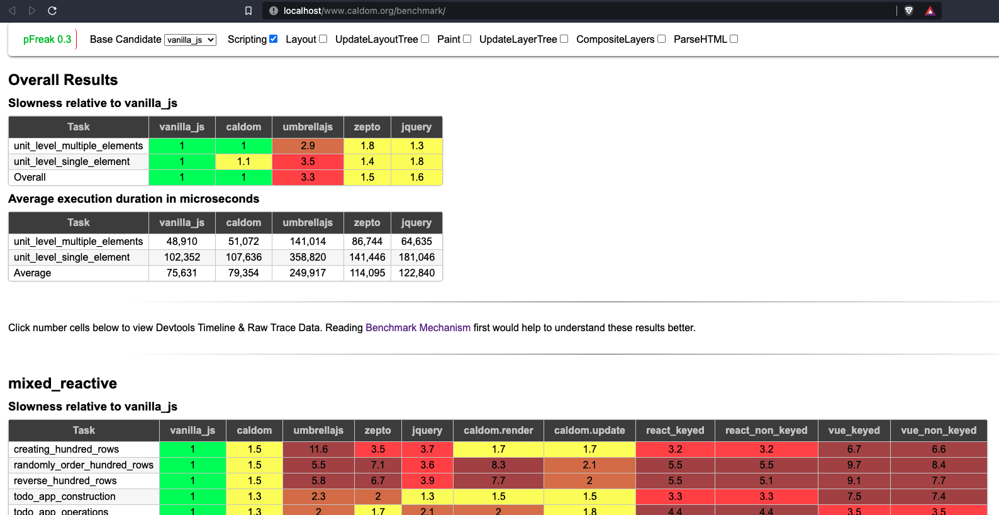
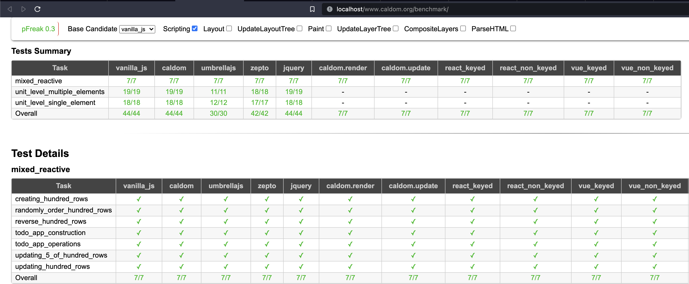
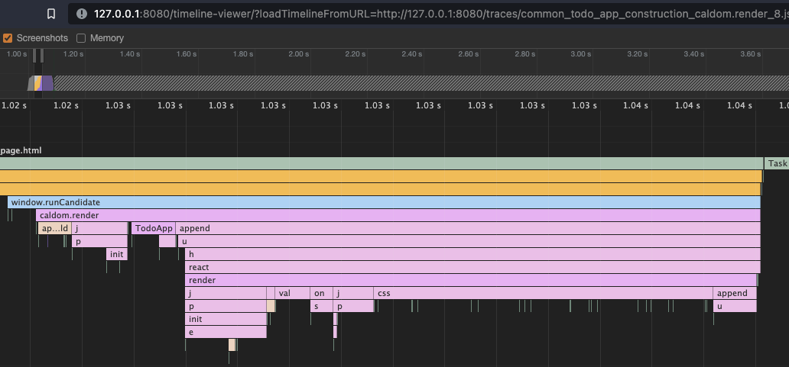

# pFreak 0.3

pFreak is a unit-level JavaScript benchmarking and testing framework.

The main objective is to re-use unit tests as a benchmark too. The framework implements a flexible way to test and benchmark multiple candidates, enabling meaningful A/B testing and measuring performance changes between versions.

Also, it's very suitable to benchmark asynchronous executions since pFreak is based on Devtool's raw trace data. It calculates execution duration of each unit of code instead of marking start-end based timing approach.

Basically, it provides a highly flexible and scalable framework to separate pre-execution setup, execution and assert function.

This was originally implemented as a part of [CalDOM](https://caldom.org) UI library development.

## How it works?
Behind the scene, pFreak is using [Puppeteer](https://github.com/puppeteer/puppeteer/) to automate the process and capture trace data through Chrome Devtools Protocol(CDP) session (same as Developer Tools Performance tab). The captured trace is processed by [devtools-timeline-model](https://github.com/paulirish/devtools-timeline-model). Then the formatted results can be viewed on the browser.

___

### Sample benchmark result preview
<p>

</p>

### Sample test result preview
<p>

</p>

### View raw trace data using [Timeline Viewer](https://github.com/ChromeDevTools/timeline-viewer)
<p>

</p>

## Benchmark Mechanism
- Each task is iterated X times and mean execution duration is taken.
- Each iteration Steps: 
    1. Open a new page ("empty\_page.html")
    2. Slowdown CPU speed by ?X
    3. Load respective library through a script tag
    4. Load respective task through a script tag
    5. Start tracing (to capture Dev Tools' performance metrics)
    6. Run Task (Puppeteer's code injection execution time is excluded by scheduling the task using setTimeout before tracing is started.)
    7. Wait X seconds for all task operations to be completed. (This can be configured per task/test)
    8. Stop tracing
    9. Assert whether the task is completed.
    10. Parse raw trace data using devtools-timeline-model to extract javascript and layout/paint execution times.
    11. Close Page

- The mean execution duration is in microseconds. (1000 Microseconds = 1 Millisecond)
- Factor of slowness is compared against the base candidate. Eg: 
    - Vanilla JS execution duration = 400ms
    - Candidate 1 execution duration= 600ms
    - Candidate 1 is 1.5x slower than Vanilla JS

___

## How to use?

```shell
npm install pfreak

cd path/to/tests
```

### 1. Initiate pFreak. This creates & link all necessary file structure

```shell
pfreak init
```
Tip: Have a look at config.json & ./tasks/_task_template.js. Configure config.json if you want.
_task_template.js is the base template to create new tests/tasks. You can modify this to suit your default template.

### 2. Create a new task/test

```shell
pfreak new-task --candidate candidate_name --category category_name --task task_name
```
This creates a new JS file in the ./tasks/ folder. Define your test/benchmark in the file using the given structure.

### 3. Run the benchmark or test-only mode
```shell
pfreak benchmark

#or

pfreak test
```

### 4. View Results
```shell
pfreak show
```
This starts an http-server at localhost:8080 and opens it.

### Refer help for details
```shell
pfreak --help
```

___

## Future Development
* Hope to expand this to Node based benchmark/tests as well (outside of the browser)
* Need a detailed documentation
* Same candidate, multiple library versions support (config.json)

___

## How to contribute?
Your contributions are very welcome. I just created this as a side project to benchmark and test the [CalDOM](https://caldom.org) UI library I created. Figured that this could be useful for others as well. I don't have a grand plan for this yet, please feel free to jump in :)


